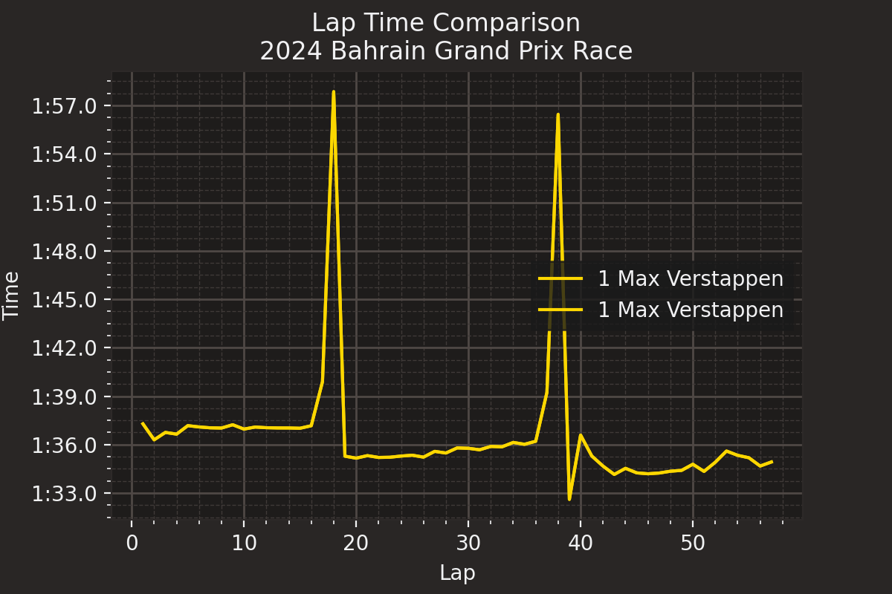

# Formula 1 Telemetry Analysis Tool

This project is a desktop application for analyzing and visualizing Formula 1 telemetry data. It uses the **`fastf1`** Python library as its core API to fetch official F1 data and **PyQt5** to provide a user-friendly graphical interface (GUI) for comparing driver performance.

---

## Example Output

The tool generates detailed telemetry comparison plots, like the one below comparing Max Verstappen and Sergio Pérez's fastest laps.



---

## Core API: `fastf1`

This tool is built entirely on the **`fastf1`** library. This library acts as the "F1 API" by:
* Accessing and downloading official F1 telemetry data, timing data, and session information.
* Loading data for specific drivers, laps, and sessions.
* Providing utilities to process and synchronize telemetry data for comparison.
* Integrating with Matplotlib for easy plotting.

All data fetching in `script.py` is handled by `fastf1` functions like `ff1.get_session()`, `session.load()`, and `lap.get_car_data()`.

---

## Features

* **Full GUI:** A simple interface built with PyQt5 to select analysis parameters without writing code.
* **Historical Data:** Browse F1 seasons by **Year** and select any **Race Event** from that year.
* **Session Selection:** Analyze data from any session: **Race**, **Qualifying**, or Practice (**FP1, FP2, FP3**).
* **Driver Comparison:** Select any two drivers from the session to compare them head-to-head.
* **Multiple Analysis Modes:**
    * **Lap Time:** Plots a lap-by-lap time comparison for both drivers.
    * **Fastest Lap:** Generates a detailed telemetry comparison (Speed, Throttle, Brake) for each driver's fastest lap.
    * **Fastest Sectors:** Visualizes the fastest sector times for a selected lap.
    * **Full Telemetry:** Provides a comprehensive telemetry breakdown including Speed, Throttle, Brake, RPM, Gear, and Delta-t.
* **Save Plots:** Save the generated analysis plot as a PNG file.

---

## Project Files

* **`gui.py`**: The main application file. This runs the PyQt5 GUI and handles user input.
* **`script.py`**: The backend data processing script. It uses `fastf1` to fetch the session data, load telemetry, and generate the Matplotlib plots.
* **`F1_Data_Analysis.ipynb`**: A Jupyter Notebook that served as the development and testing environment for the plotting functions in `script.py`.
* **`plot.png`**: An example output file.
* **Data Files (Not Included):** The GUI requires helper CSV files (`events.csv`, `drivers.csv`, `laps.csv`) to populate the dropdown menus.

---
###Screenshot


## How to Run

### 1. Dependencies

You must have Python and the following libraries installed. `fastf1` is the key API for data.

```sh
pip install fastf1 pandas matplotlib pyqt5

###Screenshot


